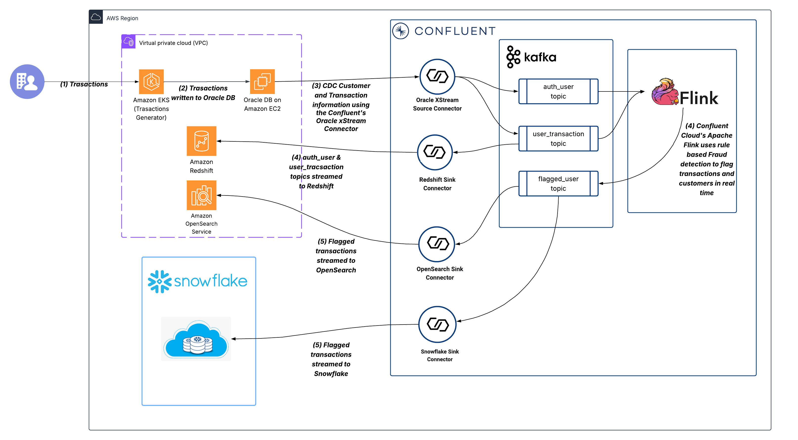

# Real Time Fraud Detection With Confluent Cloud's Kafka and Flink
This project will enable the provisioning and testing of real-time fraud detection pipelines, leveraging Connectors for data ingestion, Kafka event streams for scalable messaging, and Flink for low-latency stream processing—governed by Schema Registry for consistent data contracts—all fully orchestrated and managed within Confluent Cloud

Fraud detection is a critical safeguard for protecting the financial assets of both individuals and organizations in today’s digital-first world. As online transactions surge, fraud schemes are becoming increasingly complex, demanding smarter and more adaptive defenses. By harnessing advanced analytics and artificial intelligence, modern detection systems can uncover hidden patterns in massive datasets—spotting sophisticated fraud attempts before they cause significant damage.

This project demonstrates how financial institutions can detect fraudulent transactions in real time by streaming data directly from OLTP databases, POS terminals, and payment gateways through Kafka Connectors. Using Flink-based stream processing, transactions are continuously joined, filtered, aggregated, and analyzed with low latency—delivering a scalable and resilient foundation for modern fraud detection.

## Project Diagram

The project was built to reflect a typical software production environment. It contains many common components such as:
- An EKS Kubernetes cluster hosts an app that can be accessed via the web
- An Oracle DB

Real-Time fraud detection is achieved by adding below mentioned components:
- A Kafka Cluster to store, stream & manage transaction & fraud events
- An Oracle XStream Connector to stream database entries as Kafka events.
- A Flink Compute Pool to enrich transaction events from Oracle and morph them into data products for real-time fraud analysis 
- A Redshift Instance and Redshift fully managed sink Connector to stream authentication and user transaction events for storage
- An OpenSearch Instance and OpenSearch fully managed sink Connector to stream fraud events into dashboards for analysis and decision-making
- A Snowflake database and Snowflake fully managed sink Connector to stream fraud events for complex analytics
---

## Flow

| Step                                                                                                                | Description                                                                                                                                                                                                                                      |
| :------------------------------------------------------------------------------------------------------------------ | :----------------------------------------------------------------------------------------------------------------------------------------------------------------------------------------------------------------------------------------------- |
| (1) Transactions                                                                                                    | Customers initiate transactions which hit an Amazon EKS (Elastic Kubernetes Service) cluster running the Transactions UI application within the AWS VPC.                                                                                         |
| (2) Transactions written to Oracle DB                                                                               | The EKS application writes the new transaction data to an Amazon EC2 instance running Oracle DB.                                                                                                                                                 |
| (3) CDC Customer and Transaction information using the Confluent Fully managed Oracle xStream Connector             | The Oracle xStream Connector in Confluent Cloud uses Change Data Capture (CDC) to stream customer and transaction changes from the Oracle DB into a Confluent Cluster. The data is put into two separate topics: auth_user and user_transaction. |
| (4) Confluent Cloud for Apache Flink uses rule-based Fraud detection to flag transactions and customers in realtime | Apache Flink is used within Confluent Cloud to perform rule-based fraud detection. It processes the auth_user and user_transaction streams, applies business logic (rules), and writes flagged results to the flagged_user topic.                |
| (4) (Continued) auth_user and user_transaction topics sent to Redshift                                              | The data from the auth_user and user_transaction topics is sent back to Amazon Redshift via a Redshift Connector.                                                                                                                                |
| (5) Flagged transactions sent to OpenSearch                                                                         | The flagged_user topic (containing fraud-flagged results) is sent to Amazon OpenSearch Service via an OpenSearch Sink Connector.                                                                                                                 |
| (6) Flagged transactions sent to Snowflakle                                                                         | The flagged_user topic (containing fraud-flagged results) is sent to Snowflake Database via an Snowflake Sink Connector (using Snowpipe Streaming)                                                                                               |


## Table of Contents
1. [Prerequisites](#prerequisites)
2. [Provision Infrastructure with Terraform](#provision-infrastructure-with-terraform)
3. [Step-by-step Instructions](#labs)
4. [Clean-Up](#clean-up)
---

## Prerequisites

### Install Supporting Software
In this section we will install and validate all required software for the project with the following command

1. Follow the steps below to install required software:

   - **Windows** users will follow the installation instructions below:
      - [AWS CLI](https://docs.aws.amazon.com/cli/latest/userguide/getting-started-install.html)
      - [Terraform](https://developer.hashicorp.com/terraform/install#windows)
      - [Confluent CLI](https://docs.confluent.io/confluent-cli/current/install.html)
      - [kubectl](https://kubernetes.io/docs/tasks/tools/install-kubectl-windows/)


2. Verify the installation with the following command

   ```bash
   aws --version
   terraform -version
   confluent version
   kubectl version --client
   ```

### Create AWS API Key

AWS API keys will be provisioned and provided to users on the day of the workshop. 

### Create Confluent Cloud API Keys

Confluent Cloud `Cloud resource management` API keys are required to provision the necessary Confluent Cloud infrastructure.
</summary><details>

1. Log into Confluent Cloud
2. Open the sidebar menu and select `API keys`
3. Click `+ Add API key`
4. Associate API Key with `My account`
5. Select `Cloud resource management`
6. Create the API key and copy the Key & Secret into a usable place
</details>   

## Clone the Repo
```
git clone https://github.com/azizsaya/confluent_developerday.git
```

## Provision Infrastructure with Terraform
Terraform is used to automatically provision and configure infrastructure for both AWS and CC. 

 >[!CAUTION]
 >If the pre-requisites are not completed correctly the following will fail!


### Set Terraform Variables
Terraform is configured via a terraform.tfvars file that users will create manually. Keep the terraform.tfvars in `infra/Terraform` directory.

``` 
nano terraform.tfvars 
```

All variables in the table below must be set in the terraform.tfvars file in order for Terraform to provision the infrastructure.

```bash
confluent_cloud_api_key    = "xxxxxxxxxxx"
confluent_cloud_api_secret = "xxxxxxxxxxxxxxxxxxxxxxxx"
  ```


### Provision Infrastructure via Terraform

This step will provision all the necessary infrastructure, which may take up to 40 minutes.

Run the following commands from the same directory as the `README.md` file in order to initialize and apply Terraform.

   ```bash
   terraform -chdir=infra/Terraform init
   ```
   
   ```bash
   terraform -chdir=infra/Terraform apply --auto-approve
   ```


---

## Workflows

There are two workflows to step-by-step demonstrate two different use cases with Confluent Cloud. 
1. [Workflow 1](./LAB1/LAB1-README.md) shows the path to migration from legacy systems like Oracle to modern data warehouses like Redshift by leveraging Confluent Cloud fully managed connectors. User authentication and transaction events will be streamed from a Fraud Detection website. 
2. [Workflow 2](./LAB2/LAB2-README.md) showcases developing stream processing applications like filters, aggregations and joins in real-time with Flink and sending the newly enriched fraud data into OpenSearch dashboards and Snowflake database through Snowpipe Streeaming to facitate further analytics 

---
## Clean-up
Once you are finished with this project, remember to destroy the resources you created, to avoid incurring charges. You can always spin it up again anytime you want.

Before tearing down the infrastructure, delete the Oracle XStream, Redshift and OpenSearch connectors, as they were created outside of Terraform and won't be automatically removed:

```
confluent connect cluster delete <CONNECTOR_ID> --cluster <CLUSTER_ID> --environment <ENVIRONMENT_ID> --force
```

To destroy all the resources created run the command below from the ```terraform``` directory:

```
terraform -chdir=infra/Terraform destroy --auto-approve
```

